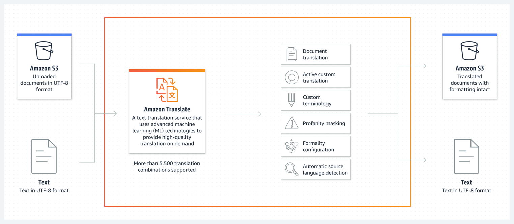
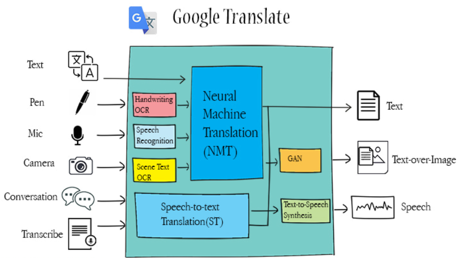

# Trình bày mô hình Machine Translation của Amazon

- Dịch vụ **Amazon Translate** sử dụng công nghệ máy học tiên tiến (machine learning) để thực hiện dịch thuật văn bản tự động, chất lượng cao, theo nhu cầu.
- Dịch vụ hỗ trợ hơn **5,500 cặp ngôn ngữ dịch** khác nhau.
- Tài liệu hoặc văn bản được dịch có thể được lưu trữ trên **Amazon S3**, duy trì nguyên vẹn định dạng.

## **Quy trình chính**

1. **Upload tài liệu**
    - Tài liệu được tải lên Amazon S3 trong định dạng UTF-8.
    - Các tài liệu này có thể là văn bản đơn giản hoặc tài liệu phức tạp với định dạng rõ ràng.

2. **Amazon Translate xử lý tài liệu**
Amazon Translate thực hiện quá trình dịch tự động với các tính năng:
    - **Document Translation:** Hỗ trợ dịch toàn bộ tài liệu, giữ nguyên định dạng ban đầu.
    - **Active Custom Translation:** Cho phép người dùng tùy chỉnh quá trình dịch theo nhu cầu, chẳng hạn như thay đổi cách dịch thuật ngữ chuyên ngành.
    - **Custom Terminology:** Người dùng có thể định nghĩa bộ từ điển riêng để Amazon Translate ưu tiên sử dụng các thuật ngữ đã định nghĩa.
    - **Profanity Masking:** Lọc các từ ngữ không phù hợp (ví dụ: từ ngữ tục tĩu) trong văn bản đầu ra.
    - **Formality Configuration:** Điều chỉnh mức độ trang trọng (formality level) của văn bản được dịch.
    - **Automatic Source Language Detection:** Tự động nhận diện ngôn ngữ của văn bản nguồn mà không cần chỉ định trước.

3. **Trả kết quả**
    - Dịch vụ trả về tài liệu đã dịch trong định dạng UTF-8.
    - Các tài liệu đã dịch có thể được lưu trên Amazon S3 với định dạng, bố cục được giữ nguyên, hoặc chỉ trả về dưới dạng văn bản thuần túy.

## **Ưu điểm chính của Amazon Translate**
- **Chất lượng dịch thuật cao:** Sử dụng công nghệ học sâu để tối ưu hóa chất lượng dịch thuật.
- **Tùy chỉnh mạnh mẽ:** Hỗ trợ các tính năng tùy chỉnh như thuật ngữ riêng, độ trang trọng, và lọc ngôn ngữ.
- **Tính tự động:** Tích hợp liền mạch với các dịch vụ AWS khác, tự động hóa quy trình dịch và lưu trữ.
- **Khả năng mở rộng:** Hỗ trợ số lượng lớn dữ liệu và ngôn ngữ, phù hợp với các tổ chức lớn.
- **Bảo toàn định dạng:** Dịch thuật tài liệu mà không làm mất định dạng gốc, rất hữu ích cho các tài liệu kinh doanh hoặc kỹ thuật.

## **Ứng dụng thực tế**
- **Thương mại điện tử:** Dịch mô tả sản phẩm cho khách hàng quốc tế.
- **Dịch vụ khách hàng:** Hỗ trợ tự động dịch nội dung email hoặc tài liệu.
- **Truyền thông đa ngôn ngữ:** Tạo nội dung cho nhiều thị trường trên toàn cầu.

# Trình bày mô hình Machine Translation của Google

Google Translate sử dụng các công nghệ hiện đại như **Neural Machine Translation (NMT)** và **Speech-to-Text Translation (ST)** để thực hiện dịch thuật. Hệ thống này hỗ trợ nhiều nguồn đầu vào khác nhau và trả về các loại đầu ra phù hợp với mục đích sử dụng.

## **Quy trình chính và thành phần**
1. **Đầu vào**
    - **Text (Văn bản)**: Văn bản thông thường do người dùng nhập.
    - **Pen (Viết tay)**: Sử dụng công nghệ OCR để nhận diện và chuyển đổi chữ viết tay thành văn bản.
    - **Mic (Âm thanh)**: Dùng công nghệ nhận diện giọng nói (Speech Recognition) để chuyển lời nói thành văn bản.
    - **Camera**: Xử lý văn bản trong hình ảnh thông qua **Scene Text OCR**.
    - **Conversation (Hội thoại)**: Dịch trực tiếp các cuộc hội thoại thời gian thực.
    - **Transcribe (Ghi âm)**: Chuyển đổi lời nói ghi âm thành văn bản và dịch.

2. **Xử lý dữ liệu**: Google Translate sử dụng hai công nghệ chính:
    - **Neural Machine Translation (NMT):**
        - Đây là cốt lõi của Google Translate, sử dụng mạng nơ-ron sâu (Deep Neural Network) để thực hiện dịch thuật văn bản một cách chính xác và tự nhiên.
        - NMT học từ ngữ cảnh và cấu trúc của câu để cung cấp bản dịch chất lượng cao.
    - **Speech-to-Text Translation (ST):**
        - Chuyển đổi giọng nói thành văn bản và sau đó áp dụng NMT để dịch ngôn ngữ.

3. **Các tính năng bổ sung**
    - **GAN (Generative Adversarial Networks):**
        - Được sử dụng trong xử lý hình ảnh và dịch văn bản trực tiếp trên ảnh (Text-over-Image).
        - **Ví dụ**: Dịch một đoạn văn bản trong ảnh và trả kết quả ngay trên ảnh gốc.
   
    - **Text-to-Speech Synthesis:**
        - Sau khi dịch, hệ thống chuyển văn bản dịch thành giọng nói, hỗ trợ giao tiếp bằng lời.

4. **Đầu ra**
    - **Text (Văn bản)**: Trả về văn bản đã dịch.
    - **Text-over-Image**: Văn bản được dịch trực tiếp hiển thị trên hình ảnh ban đầu.
    - **Speech (Âm thanh)**: Đọc bản dịch dưới dạng âm thanh.