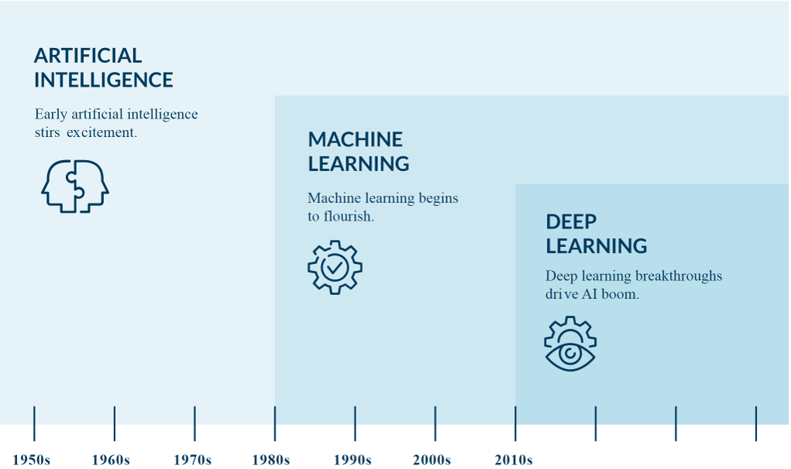

<h1 align="center">
<strong>CÂU HỎI ÔN TẬP</strong>
</h1>

- [Câu 1: Phân biệt AI, Machine Learning, Deep Learning](#câu-1-phân-biệt-ai-machine-learning-deep-learning)
    - [AI](#ai)
    - [Machine Learning](#machine-learning)
    - [Deep Learning](#deep-learning)
    - [So sánh](#so-sánh)
- [Câu 2: Khi nào dùng Classsification, cho ví dụ](#câu-2-khi-nào-dùng-classification-cho-ví-dụ)
- [Câu 3: Khi nào dùng Clustering, cho ví dụ ](#câu-3-khi-nào-dùng-clustering-cho-ví-dụ)
- [Câu 4: Khi nào dùng Regression, cho ví dụ](#câu-4-khi-nào-dùng-regression-cho-ví-dụ)
- [Câu 5: Để truy suất 1 biến global trong Python từ một hàm nào đó ta làm như thế nào? ](#câu-5-để-truy-suất-1-biến-global-trong-python-từ-một-hàm-nào-đó-ta-làm-như-thế-nào)
    - [Truy xuất giá trị của biến global](#truy-xuất-giá-trị-của-biến-global)
    - [Thay đổi giá trị của biến global](#thay-đổi-giá-trị-của-biến-global)
    - [Sử dụng global trong hàm lồng nhau](#sử-dụng-global-trong-hàm-lồng-nhau)
- [Câu 6: Lớp và đối tượng khác nhau chỗ nào?](#câu-6-lớp-và-đối-tượng-khác-nhau-chỗ-nào)
    - [Lớp (Class)](#lớp-class)
    - [Đối tượng (Object)](#đối-tượng-object)
    - [So sánh](#so-sánh-1)
- [Câu 7: Trình bày cách viết kế thừa trong Python, cách khai báo và sử dụng static method](#câu-7-trình-bày-cách-viết-kế-thừa-trong-python-cách-khai-báo-và-sử-dụng-static-method)
    - [Kế thừa](#kế-thừa)
    - [Static Method trong Python](#static-method-trong-python)
- [Câu 8: Viết chương trình quản lý sản phẩm: Xem, thêm, sửa, xóa, Serialize/Deserialize JSON](#câu-8-viết-chương-trình-quản-lý-sản-phẩm-xem-thêm-sửa-xóa-serialize-deserialize-json)

# Câu 1: Phân biệt AI, Machine Learning, Deep Learning

## AI
Trong khoa học máy tính, trí tuệ nhân tạo hay AI (tiếng Anh: artificial intelligence), đôi khi được gọi là trí thông minh nhân tạo, là trí thông minh được thể hiện bằng máy móc, trái ngược với trí thông minh tự nhiên của con người. Thông thường, thuật ngữ "trí tuệ nhân tạo" thường được sử dụng để mô tả các máy móc chủ(hoặc máy tính) có khả năng bắt chước các chức năng "nhận thức" mà con người thường phải liên kết với tâm trí, như "học tập" và "giải quyết vấn đề".

- AI bao gồm các hệ thống chatbot như ChatGPT, Siri, Alexa, hay các hệ thống tự động hóa trong sản xuất.
- Ứng dụng: Xe tự lái, phần mềm dự đoán thời tiết, quản lý tài nguyên năng lượng.

## Machine Learning
Máy học (Machine Learning) là môn khoa học nhằm phát triển những thuật toán và mô hình thống kê mà các hệ thống máy tính sử dụng để thực hiện các tác vụ dựa vào khuôn mẫu và suy luận mà không cần hướng dẫn cụ thể. Các hệ thống máy tính sử dụng thuật toán máy học để xử lý khối lượng lớn dữ liệu trong quá khứ và xác định các khuôn mẫu dữ liệu. Việc này cho phép chúng dự đoán kết quả chính xác hơn từ cùng một tập dữ liệu đầu vào cho trước. Ví dụ: các nhà khoa học dữ liệu có thể đào tạo một ứng dụng y tế chẩn đoán ung thư từ ảnh chụp X-quang bằng cách lưu trữ hàng triệu ảnh quét và chẩn đoán tương ứng.

- Hệ thống dự đoán gian lận trong giao dịch thẻ tín dụng.
- Khuyến nghị sản phẩm trên các trang thương mại điện tử như Amazon, Shopee.

## Deep Learning
Học sâu (Deep Learning) là một phương thức trong lĩnh vực trí tuệ nhân tạo (AI), được sử dụng để dạy máy tính xử lý dữ liệu theo cách được lấy cảm hứng từ bộ não con người. Mô hình học sâu có thể nhận diện nhiều hình mẫu phức tạp trong hình ảnh, văn bản, âm thanh và các dữ liệu khác để tạo ra thông tin chuyên sâu và dự đoán chính xác. Bạn có thể sử dụng các phương pháp học sâu để tự động hóa các tác vụ thường đòi hỏi trí tuệ con người, chẳng hạn như mô tả hình ảnh hoặc chép lời một tập tin âm thanh. 

- Nhận diện khuôn mặt trong ứng dụng như Facebook, Google Photos.
- Phân loại bệnh dựa trên hình ảnh y tế như MRI, CT scan.

## So sánh

|  | **Artificial Intelligence** | **Machine Learning** | **Deep Learning** |
| :- | :- | :- | :- | 
| **Khái niệm** | Mô phỏng trí tuệ con người trong máy móc | Sử dụng thuật toán để học từ dữ liệu và thực hiện dự đoán | Mô hình học tập dựa trên mạng nơ-ron sâu |
| **Phạm vi** | Rộng, bao gồm cả ML và DL | Một nhánh nhỏ của AI | Một nhánh con của ML |
| **Độ phức tạp** | Phức tạp và bao quát | Tương đối phức tạp | Rất phức tạp với yêu cầu cao về tính toán |
| **Ví dụ** | Xe tự lái, trợ lý ảo, hệ thống khuyến nghị | Dự đoán nhu cầu thị trường, phân tích cảm xúc từ văn bản | Nhận diện khuôn mặt, dịch tự động bằng mạng nơ-ron (Google Translate) |





# Câu 2: Khi nào dùng Classsification, cho ví dụ

Classification (phân loại) được sử dụng khi cần phân loại dữ liệu đầu vào vào một trong các nhóm hoặc lớp xác định trước. Đầu ra của mô hình là các nhãn (categories).

- **Phân loại email**: Xác định email là spam hay không spam.
- **Dự đoán bệnh**: Phân loại một bệnh nhân có bị mắc bệnh ung thư (có/không) dựa trên các đặc điểm sinh học.
- **Nhận diện hình ảnh**: Phân loại hình ảnh là chó, mèo hay xe hơi.
- **Tài chính**: Phân loại khách hàng có khả năng vỡ nợ hay không dựa trên lịch sử tín dụng.


# Câu 3: Khi nào dùng Clustering, cho ví dụ 

Clustering (phân cụm) được sử dụng khi cần chia dữ liệu thành các nhóm hoặc cụm dựa trên sự tương đồng giữa các điểm dữ liệu mà không cần nhãn trước. Thường dùng trong các bài toán khám phá hoặc không có sẵn nhãn (unsupervised learning).

- **Marketing**: Phân cụm khách hàng dựa trên hành vi mua sắm để đưa ra chiến lược quảng cáo khác nhau.
- **Phân tích dữ liệu địa lý**: Phân nhóm các khu vực dựa trên mật độ dân cư, điều kiện kinh tế.
- **Xử lý văn bản**: Phân cụm tài liệu thành các nhóm dựa trên chủ đề.
- **Sinh học**: Phân cụm các gen dựa trên biểu hiện để nghiên cứu về các loại bệnh.

# Câu 4: Khi nào dùng Regression, cho ví dụ

Regression (hồi quy) được sử dụng khi cần dự đoán một giá trị liên tục (continuous value) dựa trên các yếu tố đầu vào.

- **Dự báo giá nhà**: Dự đoán giá nhà dựa trên diện tích, vị trí, số phòng, và tiện ích.
- **Phân tích tài chính**: Dự đoán lợi nhuận doanh thu trong tương lai dựa trên dữ liệu lịch sử.
- **Năng lượng**: Dự đoán mức tiêu thụ năng lượng dựa trên thời tiết, giờ trong ngày.
- **Y tế**: Dự đoán thời gian phục hồi của bệnh nhân sau phẫu thuật dựa trên các chỉ số sinh học.

# Câu 5: Để truy suất 1 biến global trong Python từ một hàm nào đó ta làm như thế nào? 

## Truy xuất giá trị của biến global
Nếu chỉ cần đọc giá trị của biến global, bạn có thể sử dụng trực tiếp mà không cần khai báo global trong hàm.

``` py
x = 10  # global var

def print_global():
    print(x)  # read global

print_global()  # Output: 10

```

## Thay đổi giá trị của biến global
Nếu muốn thay đổi giá trị của biến global, bạn cần khai báo global bên trong hàm.

``` py
x = 10  # global var

def modify_global():
    global x  # Khai báo sử dụng biến global
    x = 20  # Thay đổi giá trị của biến global

print(x)  # Output: 10
modify_global()
print(x)  # Output: 20
```

## Sử dụng global trong hàm lồng nhau
Nếu làm việc với các hàm lồng nhau, việc truy cập hoặc sửa đổi biến global cũng yêu cầu khai báo global.

``` py
# Global var
counter = 0

def outer_function():
    def inner_function():
        global counter
        counter += 1 
        print(f"Counter after plus: {counter}")
    
    print("Execute inner_function from outer_function...")
    inner_function()

# Orginal variable
print(f"Original number of counter: {counter}")

# Call outer function
outer_function()

print(f"After outer_function: {counter}")
```

# Câu 6: Lớp và đối tượng khác nhau chỗ nào?

## Lớp (Class)
**Định nghĩa**: Lớp là một bản thiết kế hoặc khuôn mẫu (template) để tạo ra các đối tượng. Nó định nghĩa các thuộc tính (attributes) và phương thức (methods) mà các đối tượng của nó sẽ có.

**Trừu tượng**: Lớp là một khái niệm trừu tượng, không chiếm tài nguyên trong bộ nhớ cho đến khi các đối tượng được tạo ra từ nó.

**Cách sử dụng**: Dùng để định nghĩa các thuộc tính và hành vi chung mà nhiều đối tượng cùng loại sẽ có.

```py
class Car:
    def __init__(self, brand, model, year):
        self.brand = brand
        self.model = model
        self.year = year
    
    def start_engine(self):
        print(f"{self.brand} {self.model} engine started!")

# Car là một lớp, định nghĩa các thuộc tính và hành vi của xe.
```
##  Đối tượng (Object)
**Định nghĩa**: Đối tượng là một thể hiện (instance) cụ thể của một lớp. Khi một đối tượng được tạo ra từ lớp, nó sẽ có các thuộc tính và phương thức đã được định nghĩa trong lớp đó.

**Cụ thể**: Đối tượng là thực thể cụ thể của lớp, chiếm tài nguyên trong bộ nhớ.

**Cách sử dụng**: Dùng để thực hiện hành động hoặc lưu trữ thông tin cụ thể dựa trên khuôn mẫu của lớp.

```py
# Tạo đối tượng từ lớp Car
my_car = Car("Toyota", "Corolla", 2020)

# Gọi phương thức của đối tượng
my_car.start_engine()  # Output: Toyota Corolla engine started!
```

## So sánh

Tiêu chí	Lớp (Class)	Đối tượng (Object)
Khái niệm	Là khuôn mẫu hoặc bản thiết kế cho các đối tượng.	Là thể hiện cụ thể của một lớp.
Cấp độ	Trừu tượng.	Cụ thể và chiếm tài nguyên trong bộ nhớ.
Tài nguyên	Không chiếm tài nguyên cho đến khi đối tượng được tạo.	Chiếm tài nguyên trong bộ nhớ.
Vai trò	Định nghĩa các thuộc tính và phương thức.	Sử dụng các thuộc tính và phương thức đó.
Ví dụ	class Car: định nghĩa thuộc tính và hành vi.	my_car = Car("Toyota", "Corolla", 2020)

| | **Class** | **Object** |
| :-: | :- | :- |
|**Khái niệm** | Là khuôn mẫu hoặc bản thiết kế cho các đối tượng | Là thể hiện cụ thể của một lớp |
| **Cấp độ** | Trừu tượng | Cụ thể và chiếm tài nguyên trong bộ nhớ |
| **Tài nguyên** | Không chiếm tài nguyên cho đến khi đối tượng được tạo | Chiếm tài nguyên trong bộ nhớ |
| **Vai trò** | Định nghĩa các thuộc tính và phương thức | Sử dụng các thuộc tính và phương thức đó |
| **Ví dụ** | `class Car:` định nghĩa thuộc tính và hành vi | `my_car = Car("Toyota", "Corolla", 2020)` |


# Câu 7: Trình bày cách viết kế thừa trong Python, cách khai báo và sử dụng static method

## Kế thừa
Kế thừa là một tính năng trong lập trình hướng đối tượng (OOP) cho phép một lớp (class con) kế thừa các thuộc tính và phương thức từ một lớp khác (class cha). Kế thừa giúp tái sử dụng mã và mở rộng chức năng.

```py
# Lớp cha (Parent Class)
class Animal:
    def __init__(self, name):
        self.name = name

    def speak(self):
        return f"{self.name} makes a sound."

# Lớp con (Child Class)
class Dog(Animal):
    def speak(self):  # Ghi đè (override) phương thức từ lớp cha
        return f"{self.name} barks."

# Tạo đối tượng từ lớp con
dog = Dog("Buddy")
print(dog.speak())  # Output: Buddy barks
```

> [!NOTE]
> **Ghi đè phương thức**: Lớp con có thể định nghĩa lại phương thức của lớp cha.
> **Sử dụng phương thức lớp cha**: Dùng super() để gọi phương thức từ lớp cha.

```py
class Dog(Animal):
    def __init__(self, name, breed):
        super().__init__(name)  # Gọi hàm __init__ của lớp cha
        self.breed = breed

    def speak(self):
        return f"{self.name}, a {self.breed}, barks."
```

## Static Method trong Python
Static method là phương thức không yêu cầu truy cập đến bất kỳ thuộc tính hoặc phương thức nào của đối tượng (không cần self) hoặc lớp (không cần cls). Nó được dùng để định nghĩa các hành vi liên quan đến lớp, nhưng không thay đổi trạng thái của lớp hoặc đối tượng.

```py
class Math:
    @staticmethod
    def add(a, b):
        return a + b

    @staticmethod
    def multiply(a, b):
        return a * b

# Gọi static method mà không cần tạo đối tượng
print(Math.add(3, 5))       # Output: 8
print(Math.multiply(4, 6))  # Output: 24
```

- Khai báo với ```@staticmethod```: Đây là một decorator dùng để xác định phương thức tĩnh.
- Không có tham số self hoặc cls.

| **Loại phương thức** | **Khai báo** | **Đặc điểm** |
| :- | :-: | :- |
| **Instance Method** | Không có decorator | Tham chiếu self, làm việc với trạng thái của đối tượng.
| **Class Method** | ```@classmethod``` | Tham chiếu cls, làm việc với trạng thái của lớp.
| **Static Method** | ```@staticmethod``` | Không tham chiếu self hoặc cls, độc lập với trạng thái.

# Câu 8: Viết chương trình quản lý sản phẩm: Xem, thêm, sửa, xóa, Serialize/Deserialize JSON

**[Coding](Question_8.py)**
